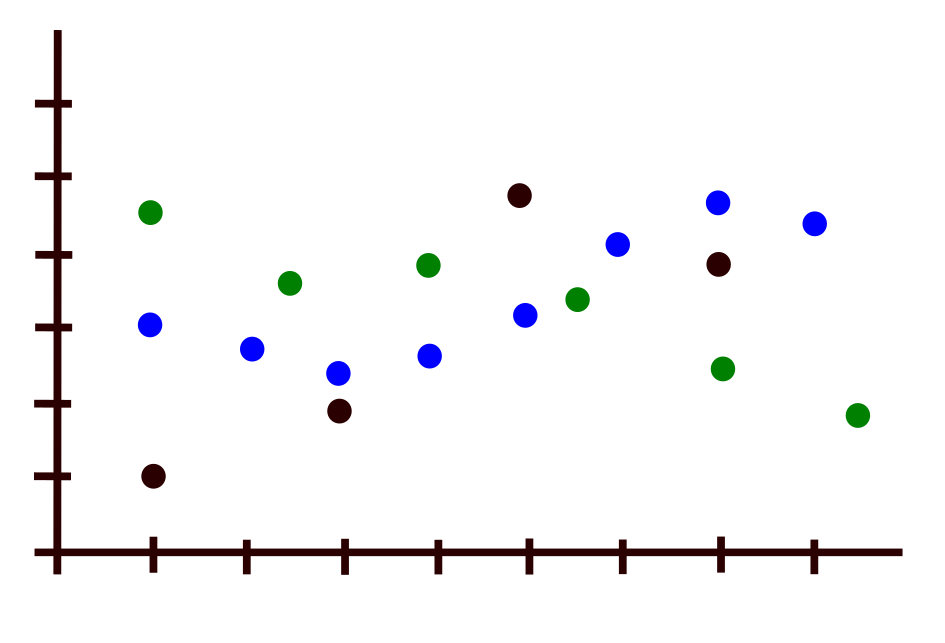
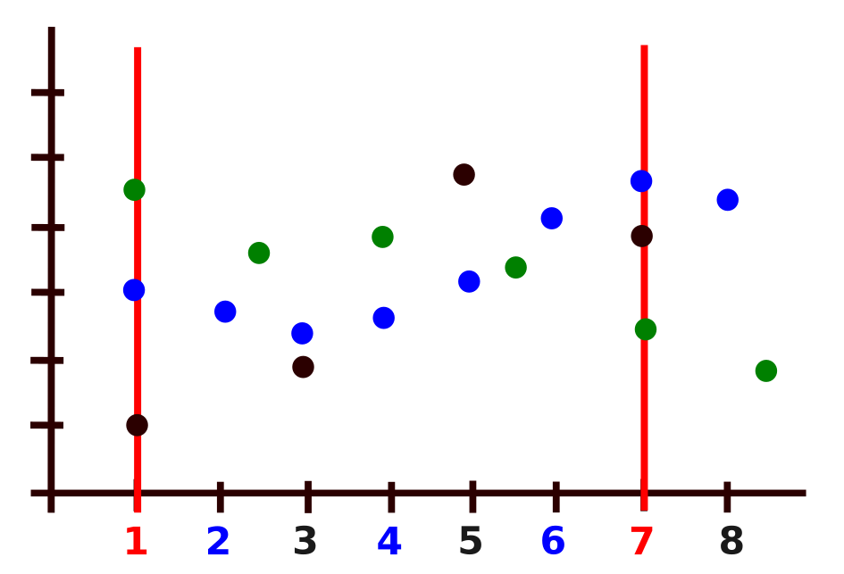
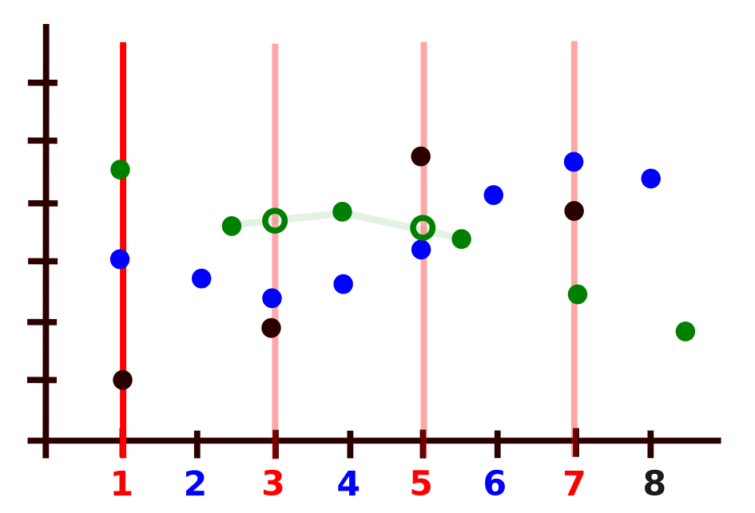
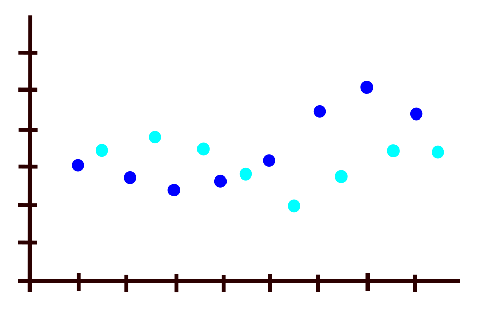
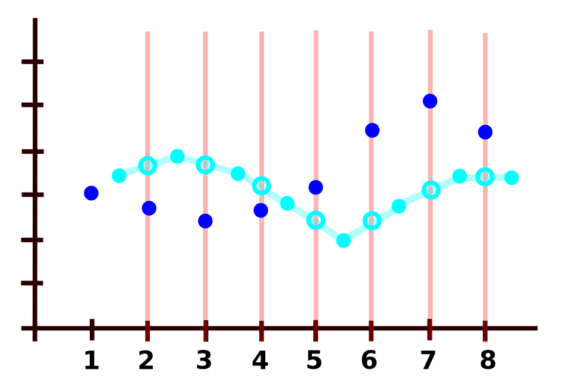
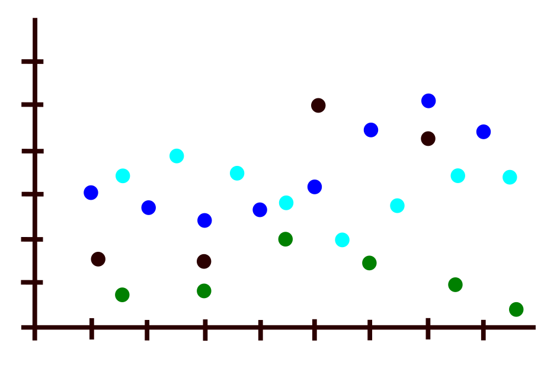
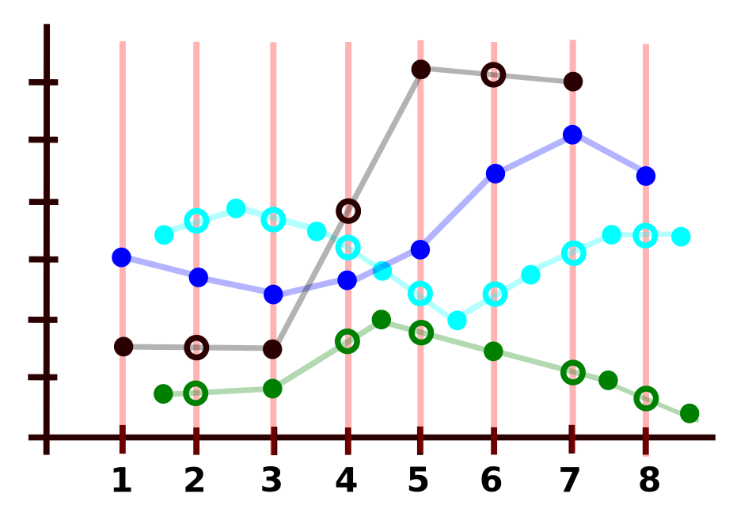

What is a synchronization of measures?
======================================

We have several sets of measures done at regular time intervals and
presented one below each other. We want to obtain a table with a
single column for the time frame and all synchronized measures
align on the same line in order to be able to do conduct analysis
based on synchronized measures.

.. image:: img/settable.png
    :width: 762
    :align: center
    :alt: sets into a table

If the measures are already synchronized, the action is only to 
re-organize the sets as shown in the figure above.

Now the measures may have started on the same time, but have different 
sampling rates. In the figure below As example, one set has a measure 
every tick (the blue points), the other every two ticks (the blacks)
and the third every 1 and half (the greens).

The synchronization of all measures is happening every seven ticks.

The synchronized steps will grow with the number of different steps
(for mathematicians, it is the Lower Common Multipliers of the time
steps). If the measures variations between those synchronized time 
steps remain acceptable, one has only to decide, which will be the
best representative values within this new synchronized time steps:
it can be the values at the synchronized ticks, but it can also be 
the average on the interval, or the maximum, or the minimum. The 
value happening at the synchronized tick has no particular reason
to be the best representative for the given interval and one can
see that this synchronization will already introduce a bias.

If this synchronized step judge too long versus the variations of
the values, one can choose a shorter one, but then some values have
to be interpolated as it is the case for the green point in the
figure below, so introducing a bias, that cannot be avoided.

If the measures are not starting on the same time, the case of 
lack of synchronization will increase. One can just take the
example of two sets with the same time step and starting not
at the same time as shown in the example below. There will be
no synchronized steps possible.

For this case, on set of measure needs to be interpolated.

In this case, one can see that linear interpolation introduces
here a break in the curve, which could be avoided by a
polynomial interpolation.

If we now re-introduce the others cases we saw, the general
appearance is becoming this one.

In the general cases, the interpolation of values cannot be 
avoided and is anyhow not worth than selecting values in a
given interval.

