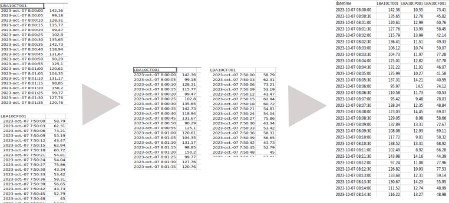

.. -*- coding:utf-8-unix; mode: sphinx-mode; -*-

What is SyncReadings?
=====================

To conduct an analysis on an industrial process, one often need to compare 
measures taken at the same time from different instruments. But those
measures may be collected as independent sets of times plus values. SyncReading 
is an application to help reorganizing such sets into a table of synchronized
measures, which means a table with a single time column applicable to all
readings gathered on the same line.

The sets of measures are supposed to come from an industrial installation
having instruments reporting measure regularly to a control system, which
is archiving them. By default, the instruments are reporting at constant
time intervals. In the best situation, the readings are synchronized, which
means that they happen at the same time. But this application can also
propose a solution of synchronization if it is not the case. On has just to
be aware, that this might introduce some bias during the needed transformations
of the readings. 

User instructions.
==================

The application screen is made of a menu, an internal frame and a status line 
placed at the bottom. The status line will give continuous information on our
status in the application.

The first user action should be to load a sets of data with the command 
`Load File` from the menu `Input File`. The sets of data is shown in the
frame in the background. The next actions are with the menu `Data Table`, 
either to obtain information on the sets `Sets Analysis` or to transfer the
set into a table of synchronized measures with `Format into table`. When
the sets are moved into a table, it is shown in the frame in the background,
replacing the former sets.

Then the user can choose to export the table either in a **csv** table or
a **xlsx**. Otherwise, the user can also close the file with this commande
under the menu `Input File` or exit the application.

What is GenSets?
================

**GenSets** is an interface to generate sets of fictive measures, that can
be used as input of **SyncReading** for testing purpose.

The graphical interface allows to construct the number of sets one which
to create and their characteristics:

.. list-table:: 
    :widths: 30 70

    * - starting date-time
      - 
    * - ending date-time
      -
    * - the step 
      - the time duration between two measures.
    * - function
      - a function to give a general shape to the measures
    * - minimum
      -
    * - maximum
      - 
    * - random
      - the percentage of deviation from the function given.

 